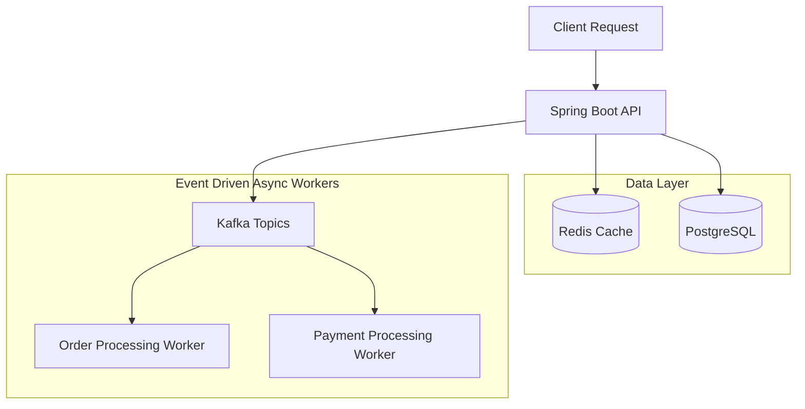

# FlashFlow Architecture

This document describes the high-level architecture of FlashFlow, designed for high-concurrency e-commerce scenarios.

## Core Components

1. **Spring Boot App**: The main application exposing REST endpoints, handling business logic (minimally implemented in this POC), and interacting with DB, Redis, and Kafka.
2. **PostgreSQL**: The primary database for persistent data (Users, Products, Inventory, Orders, Payments, Idempotency keys, Outbox Events).
3. **Redis**: In-memory data store for handling high-concurrency tasks, such as rate limiting, idempotency checks, and pre-deducting stock/reservations to avoid overwhelming the database.
4. **Kafka**: Event-streaming platform for asynchronous processing. Helps decouple order creation, payment processing, and notifications.

## Architecture Diagram

## Data Model Overview

* **User**: Customer details.
* **Product**: Item details.
* **Inventory**: Stock tracking (Total, Available, Reserved).
* **Reservation**: Temporary hold on stock during checkout.
* **Order**: Finalized purchase record.
* **Payment**: Transaction status for the order.
* **Idempotency**: Tracking API requests to prevent duplicate processing.
* **OutboxEvent**: Events waiting to be published to Kafka (Transactional Outbox Pattern).
