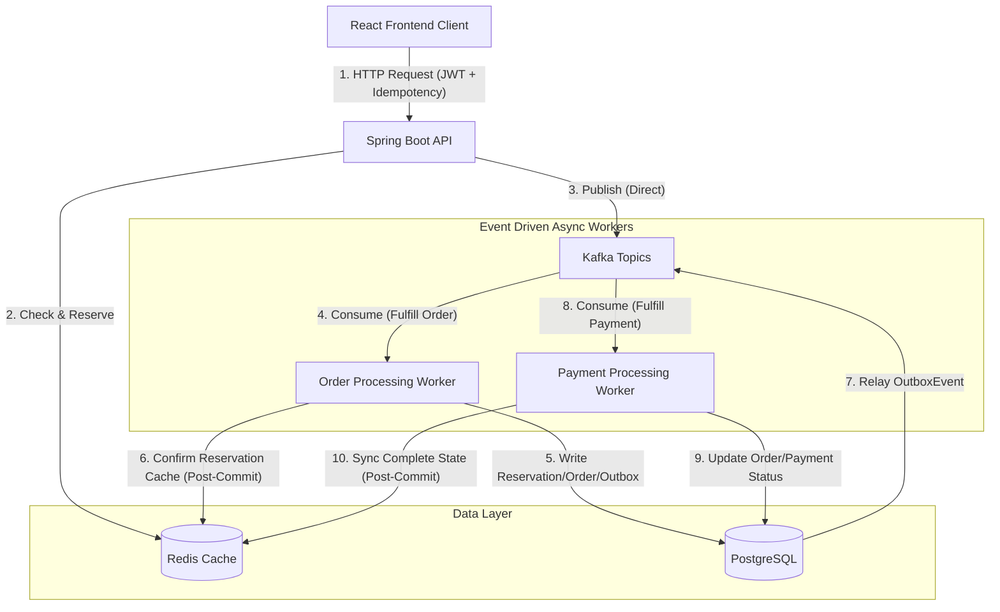
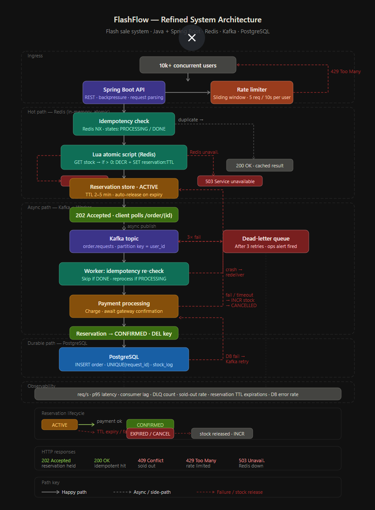
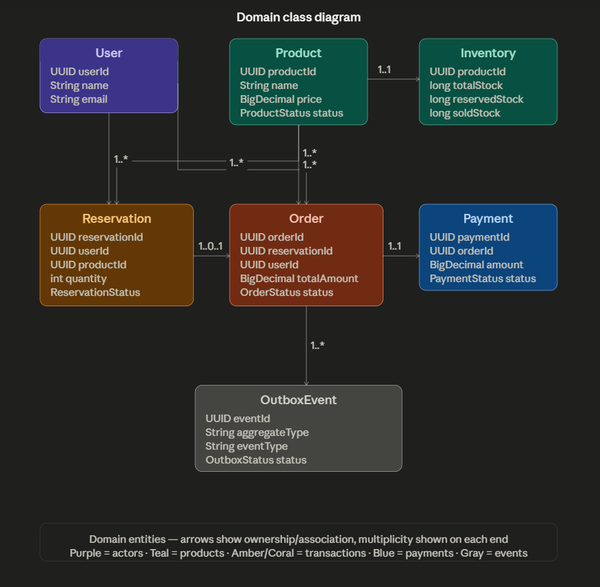
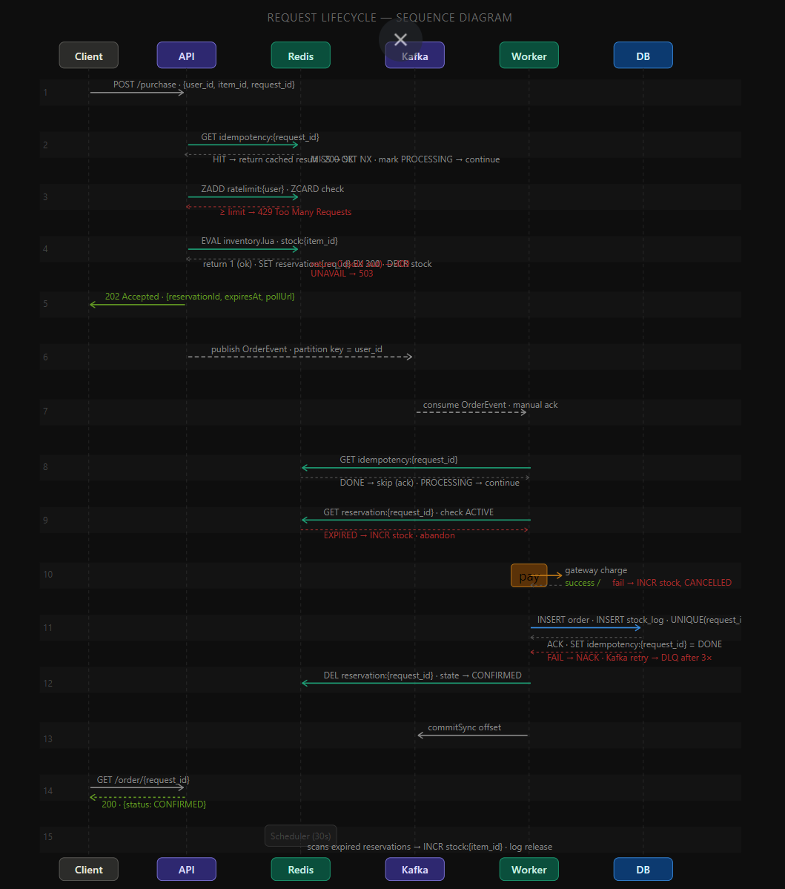

# FlashFlow Architecture

This document describes the high-level architecture of FlashFlow, designed for high-concurrency e-commerce scenarios.

## Core Components

1. **Vite/React Frontend Client**: Modern React SPA (`client/`) powered by Tailwind CSS 4 that coordinates authentication, catalog browsing, purchase requests (sending idempotency keys), and polling order status.
2. **Spring Boot App**: The main application server (`server/`) exposing REST endpoints. On the `/purchase` hot checkout path, it executes completely statelessly relative to PostgreSQL (verifying and reserving stock in Redis and publishing events directly to Kafka). It also runs async background workers and schedules.
3. **PostgreSQL**: The primary database for persistent data (Users, Products, Inventory, Orders, Payments, Idempotency keys, Outbox Events). It serves as the eventual source of truth.
4. **Redis**: In-memory data store for handling high-concurrency tasks, such as user rate limiting, idempotency caches, and pre-deducting stock/reservations using Lua scripts to prevent DB overload.
5. **Kafka**: Distributed event broker acting as the buffer for asynchronous fulfillment. Checkout events are processed asynchronously by workers to decouple client threads from database writes and external APIs.

## Architecture Diagram

```mermaid
graph TD
    Client[React Frontend Client] -- "1. HTTP Request (JWT + Idempotency)" --> API[Spring Boot API]
    API -- "2. Check & Reserve" --> Redis[(Redis Cache)]
    API -- "3. Publish (Direct)" --> Kafka[Kafka Topics]
    
    subgraph Data Layer
        Redis
        DB[(PostgreSQL)]
    end
    
    subgraph Event Driven Async Workers
        Kafka -- "4. Consume (Fulfill Order)" --> OrderProcessor[Order Processing Worker]
        OrderProcessor -- "5. Write Reservation/Order/Outbox" --> DB
        OrderProcessor -- "6. Confirm Reservation Cache (Post-Commit)" --> Redis
        
        DB -- "7. Relay OutboxEvent" --> Kafka
        
        Kafka -- "8. Consume (Fulfill Payment)" --> PaymentProcessor[Payment Processing Worker]
        PaymentProcessor -- "9. Update Order/Payment Status" --> DB
        PaymentProcessor -- "10. Sync Complete State (Post-Commit)" --> Redis
    end
```

## Data Model Overview

* **User**: Customer credentials and role mapping (USER, ADMIN).
* **Product**: Item details and state control (ACTIVE, INACTIVE, OUT_OF_STOCK).
* **Inventory**: Stock tracking (Total, Available, Reserved) with pessimistic/optimistic JPA version checks.
* **Reservation**: Temporary hold on stock during checkout (ACTIVE in Redis/DB, CONFIRMED in Redis/DB, EXPIRED, CANCELLED).
* **Order**: Finalized purchase record (CREATED, CONFIRMED, FAILED, CANCELLED).
* **Payment**: Transaction status for the order (PENDING, SUCCESS, FAILED).
* **Idempotency**: Tracking API requests to prevent duplicate processing (PROCESSING, ORDER_CREATED, COMPLETED, FAILED).
* **OutboxEvent**: Events waiting to be published to Kafka (Transactional Outbox Pattern used by workers for reliable state propagation).

## Database Schema Migrations (Flyway)
Database tables and schemas are managed incrementally via Flyway:
* `V1__init.sql`: Initial base schema defining core tables and optimization indexes.
* `V2__create_flash_sale.sql`: Introduces flash sale configurations and join relations.
* `V3__add_flash_sale_product_index.sql`: Adds indexing on flash-sale active products to optimize hot lookup queries.
* `V4__add_csrf_token_to_refresh_token.sql`: Adds Double-Submit CSRF cookie protections on refresh tokens.

## Background Schedulers
The backend employs periodic background schedulers to keep databases clean and synchronized:
* **FlashSaleScheduler:** Synchronizes product status updates between Postgres and Redis caches.
* **ReservationExpiryScheduler:** Periodically scans for expired active reservations, releases Redis stock, and updates database records.
* **IdempotencySweepScheduler:** Resolves transactions stuck in `PROCESSING` status after a timeout (5 minutes) to unlock retries.
* **RefreshTokenCleanupScheduler:** Cleans up expired refresh token entries from PostgreSQL to keep the table footprint compact.

## Domain Class Diagram

## Sequence Diagram

