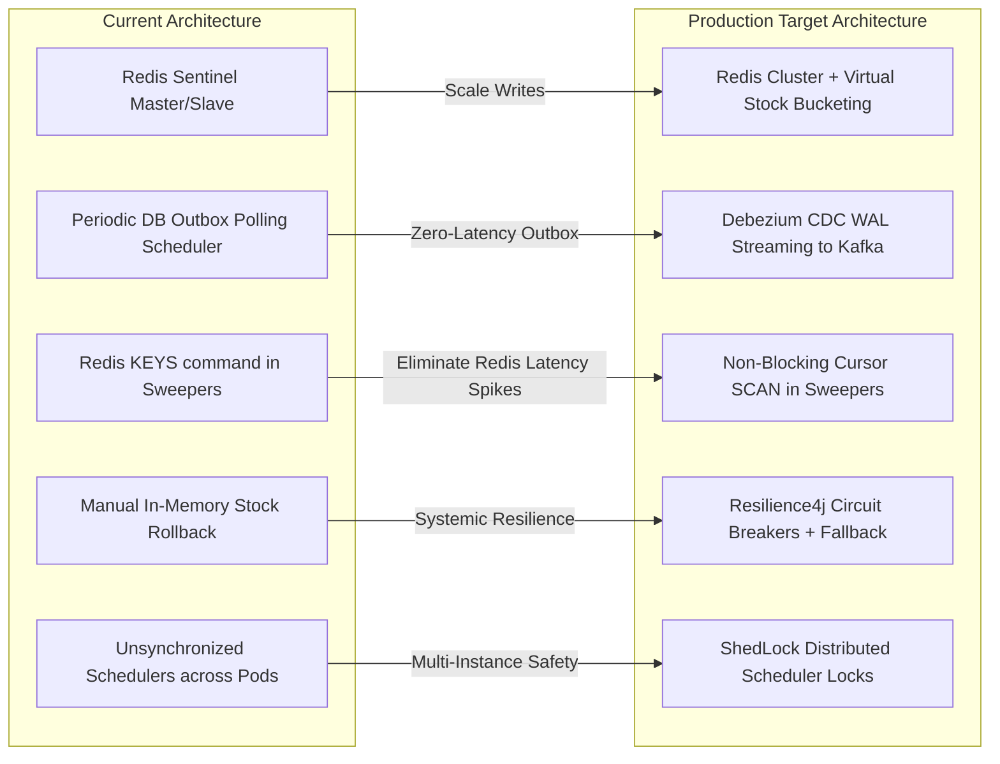

# FlashFlow: Comprehensive Failure Mechanisms, Fault Handling & Recovery Report

## Executive Summary & Failure Philosophy

In high-concurrency distributed e-commerce architectures (specifically flash sale environments subjected to 10,000+ requests per second), **failures are not anomalies—they are operational certainties**. Network partitions, memory exhaustion, message broker rebalances, database lock contentions, worker process crashes, and cascading downstream timeouts will occur during peak traffic bursts.

FlashFlow solves this challenge using an **Asymmetric Write Architecture**:
1. **Synchronous Fast Path (API Tier)**: Decoupled entirely from the persistent database. State checks, user rate-limiting, and atomic inventory reservations occur entirely in-memory within **Redis**, followed by direct event emission to **Apache Kafka**.
2. **Asynchronous Fulfillment Tier (Worker Engine)**: Dedicated Kafka consumer worker pools consume reservation events, execute ACID transactional updates against **PostgreSQL**, insert downstream **Transactional Outbox** events, and synchronize final states back to Redis via post-commit transaction synchronization hooks.
3. **Autonomous Reconciliation Tier (Background Schedulers)**: Self-healing background daemons cross-check data consistency across Redis and PostgreSQL, resolve stuck transactions, republish orphaned events, and clean expired reservations.

This report delivers a deep, production-grade technical analysis of **every failure mechanism across Redis, Kafka, Consumer-Producer workers, PostgreSQL, and cross-tier concurrency boundaries**, detailing the **exact execution flow**, **current mitigations**, and **future production improvements**.

---

## Architecture & Failure Boundaries Map

```mermaid
flowchart TD
    Client([React Client]) -->|1. POST /purchase| API[Spring Boot API Hot Path]
    
    subgraph Hot Path Failure Zone [Hot Path Failure Zone]
        API <-->|Redis Failures:\n- Crash/Timeout\n- Stock Miss\n- Eviction| Redis[(Redis 7)]
        API <-->|Kafka Producer Failures:\n- Timeout\n- Rollback Stock\n- Node Crash| KafkaBuffer[Kafka flashflow.orders]
    end

    subgraph Worker & DB Failure Zone [Worker & DB Failure Zone]
        KafkaBuffer -->|Consumer Failures:\n- Worker Crash\n- Poison Pill / DLT\n- Backpressure| Worker[Order Consumer Worker]
        Worker <-->|DB Failures:\n- OptimisticLocking\n- Connection Pool Exhaustion\n- Unique Key Collision| Postgres[(PostgreSQL DB)]
        Worker -->|Transactional Outbox| OutboxRelay[Outbox Relay Scheduler]
        OutboxRelay -->|Downstream Relay Failures| KafkaPayments[Kafka flashflow.payments]
    end

    subgraph Self-Healing Reconciliation Zone [Self-Healing Reconciliation Zone]
        ReconSweeper[Reservation Reconciliation Sweeper] <-->|Scan Orphans (Every 30s)| Redis
        ReconSweeper <-->|Cross-Check Consistency| Postgres
        ReconSweeper -.->|Republish (Up to 3x) / Expire| KafkaBuffer
        IdempSweeper[Idempotency Sweeper] <-->|Sweep Stuck Keys (Every 60s)| Postgres
        ExpirySweeper[Reservation Expiry Sweeper] <-->|Expire Stale Holds| Postgres
    end
```

---

## 1. Redis Failure Mechanisms & Handling

### 1.1 Hot-Path Redis Connection Loss / Server Crash
* **Failure Trigger**: Redis process crashes, host kernel runs out of memory, network switch partitions Redis from the API nodes, or connection socket times out.
* **Point of Impact**: [PurchaseService.java](file:///d:/projects/flashflow/server/src/main/java/com/krushna/flashflow/order/PurchaseService.java#L74-L170) executing rate-limiting, idempotency lookups, product metadata checks, or stock reservation.
* **Exact Execution Flow**:
  1. The Lettuce Redis client throws a `RedisConnectionException` or `QueryTimeoutException`.
  2. The exception propagates up the call stack, halting the purchase execution before any inventory is reserved or Kafka message is generated.
  3. The request is intercepted by [GlobalExceptionHandler.java](file:///d:/projects/flashflow/server/src/main/java/com/krushna/flashflow/common/exception/GlobalExceptionHandler.java#L100-L109), which catches `Exception.class` and returns `HTTP 500 Internal Server Error` (or `HTTP 503 Service Unavailable`).
  4. **Data Consistency State**: No partial state exists in Redis, no message was sent to Kafka, and PostgreSQL was never touched. The system remains completely consistent.
* **High Availability Failover (Redis Sentinel)**:
  * In the Sentinel profile (`application-redis-sentinel.properties`), 3 Sentinel nodes monitor `redis-master` and `redis-slave`.
  * If `redis-master` misses heartbeats for `5000ms`, Sentinel initiates a quorum election and promotes `redis-slave` to master.
  * The Lettuce driver listens to Sentinel Pub/Sub events and automatically re-routes read/write commands to the newly elected master without requiring an API server restart.

### 1.2 Redis Stock Cache Miss & Lazy-Load Concurrency Race
* **Failure Trigger**: An active flash sale product's stock key (`inventory:stock:<productId>`) is not present in Redis (due to cache expiration, cold start, or memory eviction).
* **Point of Impact**: [PurchaseService.java](file:///d:/projects/flashflow/server/src/main/java/com/krushna/flashflow/order/PurchaseService.java#L153-L163) and [RedisInventoryService.java](file:///d:/projects/flashflow/server/src/main/java/com/krushna/flashflow/inventory/redis/RedisInventoryService.java#L31-L34).
* **Exact Execution Flow**:
  ```mermaid
  sequenceDiagram
      autonumber
      participant API1 as API Thread 1
      participant API2 as API Thread 2
      participant Redis as Redis
      participant DB as PostgreSQL
      
      API1->>Redis: GET inventory:stock:<productId> -> null (Cache Miss)
      API2->>Redis: GET inventory:stock:<productId> -> null (Cache Miss)
      API1->>DB: Query inventory (availableStock = 100)
      API2->>DB: Query inventory (availableStock = 100)
      API1->>Redis: SETNX inventory:stock:<productId> 100 -> Success (true)
      API2->>Redis: SETNX inventory:stock:<productId> 100 -> Ignored (false, key exists)
      API1->>Redis: Execute Lua reserveStock(qty=1) -> Stock decremented to 99
      API2->>Redis: Execute Lua reserveStock(qty=2) -> Stock decremented to 97
  ```
  1. Thread 1 and Thread 2 both detect `stockInRedis == null`.
  2. Both query PostgreSQL for `availableStock`.
  3. FlashFlow executes `redisInventoryService.setStockIfAbsent(productId, dbInventory.getAvailableStock())` which relies on Redis `SETNX`.
  4. Only the first `SETNX` succeeds; the second is discarded. This prevents late-arriving threads from overwriting decremented in-flight inventory with stale DB values.
  5. Subsequent calls execute the Lua reservation script cleanly against the single populated key.

### 1.3 Redis Atomic Lua Script Execution Failure
* **Failure Trigger**: Redis fails mid-script execution due to out-of-memory or script execution timeouts.
* **Handling**:
  * Redis Lua scripts are inherently transactional; Redis executes the script atomically on its single event loop.
  * If the script returns `0` (insufficient stock), `PurchaseService` throws `IllegalArgumentException("Insufficient stock available")`, returning `400 Bad Request` to the client.
  * If the script returns `-1` (missing key), the system triggers the lazy-load path above.

### 1.4 Redis Key Eviction / Memory Pressure
* **Failure Trigger**: Redis runs out of memory while holding transient reservations and idempotency records.
* **Mitigation**:
  * Production deployment requires `maxmemory-policy noeviction`.
  * If keys were evicted randomly (e.g. under `allkeys-lru`), an active reservation metadata key (`reservation:<id>:meta`) could vanish, preventing the reconciliation sweeper from detecting an orphaned transaction.

---

## 2. Kafka & Producer Failure Mechanisms & Handling

### 2.1 Hot-Path Direct-Publish Failure (Redis Rollback)
* **Failure Trigger**: Stock is successfully decremented in Redis, but publishing the `OrderRequestedEvent` to Kafka fails due to broker network timeout, partition leader unavailability, or buffer saturation.
* **Point of Impact**: [PurchaseService.java](file:///d:/projects/flashflow/server/src/main/java/com/krushna/flashflow/order/PurchaseService.java#L215-L226).
* **Exact Execution Flow**:
  ```mermaid
  sequenceDiagram
      autonumber
      participant Client as Client
      participant API as PurchaseService
      participant Redis as Redis
      participant Kafka as Kafka (flashflow.orders)

      Client->>API: POST /purchase (quantity = 2)
      API->>Redis: Lua Reserve Stock (Stock: 10 -> 8) [SUCCESS]
      API->>Kafka: kafkaTemplate.send(OrderRequestedEvent)
      Kafka--xAPI: TimeoutException / BrokerNotAvailableException
      Note over API: Catch Exception Block Triggered
      API->>Redis: redisInventoryService.releaseStock(productId, 2)
      Note over Redis: Stock incremented back (8 -> 10)
      API-->>Client: HTTP 500 "Kafka publish failed" (Stock restored)
  ```
  1. `redisInventoryService.reserveStock(productId, quantity)` succeeds.
  2. `kafkaTemplate.send(record)` throws `Exception`.
  3. The `catch (Exception e)` block catches the error, logs the failure, and synchronously invokes `redisInventoryService.releaseStock(productId, quantity)`.
  4. Redis stock is immediately incremented back via `INCRBY`.
  5. The exception is rethrown, resulting in an `HTTP 500` error to the client with zero stock leakage.

### 2.2 Outbox Relay Scheduler Failure (Downstream Payments Relay)
* **Failure Trigger**: Database worker successfully writes Order & OutboxEvent (`ORDER_CREATED`), but [OutboxPublisherScheduler.java](file:///d:/projects/flashflow/server/src/main/java/com/krushna/flashflow/common/OutboxPublisherScheduler.java#L31-L85) fails to publish the event to `flashflow.payments`.
* **Point of Impact**: Background scheduler running every 5 seconds.
* **Exact Execution Flow**:
  1. The scheduler fetches pending outbox events (`status = PENDING`).
  2. It attempts an asynchronous send via `kafkaTemplate.send(topic, key, payload)`.
  3. On failure (`CompletableFuture.exceptionally`), `outboxService.handleFailure(eventId, maxRetries)` is invoked.
  4. The event's `retryCount` is incremented.
  5. If `retryCount < maxRetries` (default: 3), the event remains in `PENDING` state to be retried on the next 5-second tick.
  6. If `retryCount >= maxRetries`, the event status is transitioned to `FAILED`, and an alert log is emitted for administrative intervention.

### 2.3 Kafka Broker Unreachable / Message Buffering
* **Producer Configuration**:
  * `acks=all`: Ensures the leader broker does not acknowledge messages until all in-sync replicas (ISRs) have written the event to their commit log.
  * `enable.idempotency=true`: Attaches a producer ID (PID) and sequence number to each batch, preventing duplicate records inside Kafka partitions in the event of transient network retries.

---

## 3. Kafka Consumer & Worker Failure Mechanisms & Handling

### 3.1 Worker Process Crash Mid-Transaction
* **Failure Trigger**: The JVM running [OrderRequestedConsumer.java](file:///d:/projects/flashflow/server/src/main/java/com/krushna/flashflow/order/kafka/OrderRequestedConsumer.java) crashes or is killed (`SIGKILL`) while executing [OrderFulfillmentService.java](file:///d:/projects/flashflow/server/src/main/java/com/krushna/flashflow/order/OrderFulfillmentService.java).
* **Exact Execution Flow**:
  1. The database transaction is rolled back automatically by PostgreSQL because the database connection closes abruptly without a `COMMIT`.
  2. Spring Kafka has not committed the consumer offset for that message because offset commit is container-managed and executes only after the listener method returns cleanly.
  3. The Kafka broker detects the dead consumer heartbeat, marks the consumer group as rebalancing, and assigns the partition to another active worker pod.
  4. The new worker re-reads the uncommitted message from the last committed offset and executes fulfillment.
  5. **Deduplication Guard**: When the new worker executes, `reservationRepository.findById(reservationId)` and `orderRepository.existsByReservationId(reservationId)` verify whether any previous attempt partially committed. If already present, it logs a warning and cleanly exits, guaranteeing **Strict Exactly-Once Fulfillment Semantics**.

### 3.2 Database Concurrency & Optimistic Locking Failures
* **Failure Trigger**: 8 concurrent consumer threads across partitions attempt to update the same Product Inventory record or Order row simultaneously in PostgreSQL.
* **Point of Impact**: [OrderRequestedConsumer.java](file:///d:/projects/flashflow/server/src/main/java/com/krushna/flashflow/order/kafka/OrderRequestedConsumer.java#L60-L76) and [PaymentRequestedConsumer.java](file:///d:/projects/flashflow/server/src/main/java/com/krushna/flashflow/payment/kafka/PaymentRequestedConsumer.java#L33-L48).
* **Exact Execution Flow**:
  ```mermaid
  sequenceDiagram
      autonumber
      participant Consumer as OrderRequestedConsumer
      participant Service as OrderFulfillmentService (@Transactional)
      participant DB as PostgreSQL

      Consumer->>Service: fulfillOrder(event) [Attempt #1]
      Service->>DB: Atomic decrementStock / JPA version check
      DB--xService: OptimisticLockingFailureException
      Service--xConsumer: Exception thrown (DB Transaction Rolled Back)
      Note over Consumer: Catch OptimisticLockingFailureException\nSleep(30ms + random(40ms) Jitter)
      Consumer->>Service: fulfillOrder(event) [Attempt #2]
      Service->>DB: Atomic decrementStock
      DB-->>Service: Updated successfully
      Service-->>Consumer: Transaction Committed
  ```
  1. The consumer catches `org.springframework.dao.OptimisticLockingFailureException`.
  2. It increments the `optimistic.lock.retry.count` Micrometer metric.
  3. If attempts are under 10, the worker thread sleeps for a jittered backoff interval: `30ms + random(40ms)`.
  4. The randomized jitter desynchronizes the competing worker threads, breaking the lock contention cycle.
  5. On retry, the worker retrieves fresh database state and succeeds.
  6. If all 10 attempts fail, the exception is rethrown to Spring's Kafka error handler.

### 3.3 Poison Pill Messages & Dead Letter Topics (DLT)
* **Failure Trigger**: Corrupted JSON payload, schema mismatch, or unresolvable business invariant error that repeatedly fails on consumption.
* **Point of Impact**: [KafkaConfig.java](file:///d:/projects/flashflow/server/src/main/java/com/krushna/flashflow/config/KafkaConfig.java#L57-L60).
* **Exact Execution Flow**:
  1. Spring's `DefaultErrorHandler` intercepts unhandled consumer exceptions.
  2. It applies a `FixedBackOff(1000L, 2L)` policy: retries twice with a 1-second delay (3 total execution attempts).
  3. If the message fails on the 3rd attempt, the `DeadLetterPublishingRecoverer` routes the message with headers (original exception message, stack trace, original topic, partition, and offset) to:
     * `flashflow.orders.DLT` for order processing failures.
     * `flashflow.payments.DLT` for payment processing failures.
  4. The consumer commits the offset on the primary topic, unblocking the partition from being permanently frozen.
  5. The dead-lettered message is visible to site reliability engineers via the admin endpoint `/admin/dlt/stats`.

### 3.4 Partial Fulfillment Failure (Post-Commit Redis State Drift)
* **Failure Trigger**: PostgreSQL transaction commits successfully, but the server crashes before `TransactionSynchronization.afterCommit()` finishes updating Redis reservation status to `CONFIRMED` or updating idempotency keys.
* **Mitigation**:
  * PostgreSQL is the immutable source of truth.
  * The background [ReservationReconciliationScheduler.java](file:///d:/projects/flashflow/server/src/main/java/com/krushna/flashflow/reservation/ReservationReconciliationScheduler.java#L87-L92) scans active Redis keys, queries PostgreSQL `reservationRepository.existsById()`, discovers the confirmed record in PostgreSQL, and updates Redis status to `CONFIRMED`.

---

## 4. PostgreSQL Database Failure Mechanisms & Handling

### 4.1 Connection Pool Exhaustion (HikariCP)
* **Failure Trigger**: Influx of concurrent consumer threads and read requests exhausts available database connections (`maximum-pool-size`).
* **Handling**:
  * **Hot-Path Immunity**: The `/purchase` API hot-path does not acquire database connections. Flash sale bursts cannot exhaust database connections through the API tier.
  * **Worker Throttling**: Kafka consumer concurrency is strictly bounded (`concurrency = "8"` per listener). With 8 order consumer threads and 8 payment consumer threads, worker connection demand is capped, preventing HikariCP pool starvation.

### 4.2 Hot-Row Lock Contention in Inventory
* **Failure Trigger**: Multiple transactions executing JPA `inventoryRepository.save(inventory)` compete for row-level locks on the single flash sale product row in the `inventory` table.
* **Mitigation Flow**:
  * Instead of standard JPA Read-Modify-Write entity operations, FlashFlow executes direct atomic SQL updates in [InventoryRepository.java](file:///d:/projects/flashflow/server/src/main/java/com/krushna/flashflow/inventory/InventoryRepository.java):
    ```sql
    UPDATE inventory 
    SET available_stock = available_stock - :quantity, 
        total_stock = total_stock - :quantity, 
        version = version + 1 
    WHERE product_id = :productId AND available_stock >= :quantity
    ```
  * This shifts concurrency resolution to PostgreSQL row-level locks executed in sub-millisecond C-level engine code, avoiding long-lived application transaction holds.

### 4.3 Full PostgreSQL Outage
* **Failure Trigger**: Database master hardware failure, disk corruption, or DB maintenance restart.
* **Exact System Behavior**:
  1. `/purchase` API requests continue to succeed in memory (reserving stock in Redis and publishing messages to Kafka).
  2. Kafka brokers buffer all order requests securely on disk partitions.
  3. Consumer workers fail database transactions and enter retry/backoff loops.
  4. Once PostgreSQL recovers and comes back online, consumer workers resume processing buffered Kafka messages sequentially without dropping a single customer transaction.

---

## 5. Cross-Tier Edge Cases & Self-Healing Schedulers

### 5.1 The Orphan Redis Reservation (API Crash Window)
* **The Problem**: An API node reserves stock in Redis, writes `reservation:<id>:meta`, but the JVM is terminated (`SIGKILL` or host failure) *before* `kafkaTemplate.send()` completes. Stock is deducted in Redis, but no event exists on Kafka or PostgreSQL.
* **The Self-Healing Flow ([ReservationReconciliationScheduler.java](file:///d:/projects/flashflow/server/src/main/java/com/krushna/flashflow/reservation/ReservationReconciliationScheduler.java))**:
  ```mermaid
  sequenceDiagram
      autonumber
      participant Redis as Redis
      participant Sweeper as ReservationReconciliationScheduler (Every 30s)
      participant DB as PostgreSQL
      participant Kafka as Kafka (flashflow.orders)

      Note over Sweeper: Scans keys "reservation:*:meta"
      Sweeper->>Redis: GET reservation:<id>:meta
      Redis-->>Sweeper: {createdAt, retryCount=0, status=ACTIVE}
      Note over Sweeper: Check: age > 15 seconds grace period? YES
      Sweeper->>DB: reservationRepository.existsById(reservationId)
      DB-->>Sweeper: false (Missing from DB -> Orphan Found)
      
      alt retryCount < 3 (Republish Attempt)
          Sweeper->>Kafka: Re-publish OrderRequestedEvent
          Sweeper->>Redis: Update meta (retryCount = 1, createdAt = now)
      else retryCount >= 3 (Reconciliation Failed)
          Sweeper->>Redis: SET reservation:<id> = "EXPIRED"
          Sweeper->>Redis: DEL reservation:<id>:meta
          Sweeper->>Redis: INCRBY inventory:stock:<productId> quantity
          Note over Redis: Stock returned to pool safely!
      end
  ```
  1. The scheduler wakes up every **30 seconds**.
  2. It scans all Redis metadata keys matching `reservation:*:meta`.
  3. For each reservation in `ACTIVE` state, it checks if its age exceeds a **15-second grace window** (allowing in-flight Kafka network latency to clear).
  4. It queries PostgreSQL: `reservationRepository.existsById(reservationId)`.
  5. If present in PostgreSQL: It syncs Redis status to `CONFIRMED` and deletes the meta key.
  6. If absent from PostgreSQL: It reconstructs the `OrderRequestedEvent` from Redis metadata and re-publishes it to `flashflow.orders`.
  7. If reconciliation fails after **3 successive attempts**, it transitions Redis reservation status to `EXPIRED`, removes the metadata, and invokes `redisInventoryService.releaseStock(productId, quantity)`, safely returning the orphaned inventory to the available pool.

### 5.2 Stuck Idempotency Keys (API Abort)
* **The Problem**: A client initiates a purchase, the idempotency key is stored as `PROCESSING`, but the connection is aborted before fulfillment completes. Subsequent retries with the same idempotency key are rejected with `409 Conflict`.
* **The Self-Healing Flow ([IdempotencySweepScheduler.java](file:///d:/projects/flashflow/server/src/main/java/com/krushna/flashflow/order/IdempotencySweepScheduler.java))**:
  1. Runs every **60 seconds**.
  2. Scans the database `idempotency` table for keys in `PROCESSING` status older than **5 minutes** (`threshold = now - 5m`).
  3. If no associated `orderId` exists, it marks the DB record as `FAILED`.
  4. It synchronizes the `FAILED` status to Redis (`redisIdempotencyService.saveIdempotency`) with a 5-minute TTL.
  5. This unblocks the client, permitting a fresh checkout retry with full audit visibility.

### 5.3 Payment Failure & Multi-Tier Stock Rollback
* **Failure Trigger**: Downstream payment gateway rejects the transaction (e.g. credit card declined, mock amount > 50,000).
* **Point of Impact**: [PaymentFulfillmentService.java](file:///d:/projects/flashflow/server/src/main/java/com/krushna/flashflow/payment/PaymentFulfillmentService.java#L127-L184).
* **Exact Execution Flow**:
  1. `PaymentService.processPayment(amount)` returns `"FAILED"`.
  2. The service sets `Payment.status = FAILED` and `Order.status = FAILED`.
  3. It fetches the `Reservation` record and updates its status to `CANCELLED`.
  4. It executes an atomic database inventory refund via `inventoryRepository.incrementStock(productId, quantity)`.
  5. It updates DB `Idempotency.status = COMPLETED` with response snapshot status `"FAILED"`.
  6. In a post-commit transaction hook (`TransactionSynchronization.afterCommit()`):
     * It queries the updated database available stock and synchronizes it to Redis via `redisInventoryService.setStock(productId, updatedStock)`.
     * It updates the Redis reservation key to `CANCELLED`.
     * It updates the Redis idempotency cache to `COMPLETED`.

---

## 6. Failure Recovery Matrix

| # | Failure Scenario | Subsystem | Trigger / Root Cause | Immediate Impact | Handling & Recovery Mechanism | Detection / Recovery Window | Data Consistency Guarantee |
| :--- | :--- | :--- | :--- | :--- | :--- | :--- | :--- |
| **1** | Redis Node Crash on Hot-Path | Cache / API | Memory exhaustion, OOM, host crash | `/purchase` cannot check/reserve stock | Exception caught; `GlobalExceptionHandler` returns 500/503. Sentinel triggers failover to replica. | 5s failover (Sentinel) | Zero overselling; DB untouched |
| **2** | Redis Cache Miss / Cold Key | Cache | Product not pre-warmed or TTL expired | Initial reserve fails in Redis | Lazy loads from DB using `SETNX` (`setStockIfAbsent`) to prevent race overwrites. | Sub-millisecond | Exact DB stock mirrored |
| **3** | Kafka Publish Failure after Redis Reserve | Broker / API | Network partition, broker timeout | Stock decremented in Redis, no message sent | Catch block in `PurchaseService` immediately invokes `releaseStock()` in Redis. | < 50ms | Atomic rollback in Redis |
| **4** | Orphan Redis Reservation (API Crash) | API Node | API JVM dies after Redis reserve before Kafka send | Stock locked in Redis, no DB record created | `ReservationReconciliationScheduler` scans `reservation:*:meta`, republishes up to 3x, then expires & refunds stock. | 15s grace, 30s sweep cycle | Eventual consistency; zero stock leakage |
| **5** | Kafka Consumer Worker Crash | Worker Tier | JVM OOM, pod eviction, `SIGKILL` | Transaction aborted; Kafka offset uncommitted | Kafka triggers partition rebalance; new worker re-consumes message. `existsById` guards against duplicate fulfillment. | Consumer heartbeat timeout (3-10s) | Exactly-once business fulfillment |
| **6** | Optimistic Lock Contention | Database | 8 concurrent workers updating same stock/order rows | `OptimisticLockingFailureException` | Worker catches error, retries up to 10 attempts with randomized jitter backoff (`30ms + random(40ms)`). | 30ms - 400ms | ACID serialized execution |
| **7** | Poison Pill Message | Broker / Worker | Corrupted JSON, data format violation | Message crashes worker on every consume attempt | `DefaultErrorHandler` retries 2 times, then `DeadLetterPublishingRecoverer` routes to `flashflow.orders.DLT`. | 2 seconds (3 attempts) | Partition unblocked; zero message loss |
| **8** | Outbox Relay Scheduler Failure | DB / Broker | Kafka broker down during outbox poll | `ORDER_CREATED` event not published to payments topic | `OutboxPublisherScheduler` tracks `retryCount`; retries on next 5s interval up to 3 times before marking `FAILED`. | 5s - 15s | At-least-once message delivery |
| **9** | Downstream Payment Failure | Payment / 3rd Party | Insufficient funds, card declined, amount > 50K | Order cannot be finalized | `PaymentFulfillmentService` sets Order/Payment to `FAILED`, Reservation to `CANCELLED`, restores DB inventory, and post-commit restores Redis stock. | Real-time (< 100ms) | Guaranteed inventory refund |
| **10** | Stuck Idempotency Key | API / Client | Client disconnects during processing | Key stuck in `PROCESSING` state | `IdempotencySweepScheduler` runs every 60s, finds keys older than 5m, sets status to `FAILED`, and frees Redis key. | 5 minutes | Prevents permanent customer checkout lock |
| **11** | Full PostgreSQL Outage | Database | Database hardware/network failure | DB writes fail; workers cannot fulfill | Hot-path continues accepting fast-path checkouts in Redis; Kafka buffers events on disk; workers resume when DB recovers. | Broker disk retention window | No checkout loss up to broker capacity |

---

## 7. Strategic Engineering Improvements (Production Roadmap)

While FlashFlow's current fault-handling mechanisms successfully resolve high-concurrency race conditions, the following architectural improvements will elevate the system to enterprise, multi-region production readiness:



### Improvement 1: Resilience4j Circuit Breakers & Graceful Degradation
* **Current Limitation**: If Redis or Kafka goes down, requests fail with unhandled runtime exceptions caught only by the global exception handler.
* **Proposed Enhancement**:
  * Implement **Resilience4j Circuit Breakers** on the `PurchaseService` entry point, `RedisInventoryService`, and `KafkaTemplate`.
  * **Fallback Behavior**: If Redis response latency exceeds `150ms` or failure rate exceeds `50%`, the circuit opens. The API immediately returns `HTTP 503 Service Unavailable` with a standardized `Retry-After: 5` header, preventing request pileups and protecting downstream infrastructure from cascading collapse.

### Improvement 2: Debezium / CDC (Change Data Capture) for Transactional Outbox
* **Current Limitation**: [OutboxPublisherScheduler.java](file:///d:/projects/flashflow/server/src/main/java/com/krushna/flashflow/common/OutboxPublisherScheduler.java) polls the PostgreSQL `outbox_events` table every 5 seconds using `SELECT ... WHERE status = 'PENDING'`. Under heavy load, frequent polling creates database index thrashing and introduces up to 5 seconds of downstream event delay.
* **Proposed Enhancement**:
  * Replace scheduled polling with **Debezium CDC (Change Data Capture)** attached to PostgreSQL's Write-Ahead Log (WAL) via logical replication.
  * When workers write to `outbox_events`, Debezium streams the change directly into Kafka in sub-milliseconds without executing any `SELECT` queries against PostgreSQL.

### Improvement 3: Replace Blocking `KEYS` with Non-Blocking `SCAN` in Schedulers
* **Current Limitation**: Both [ReservationReconciliationScheduler.java](file:///d:/projects/flashflow/server/src/main/java/com/krushna/flashflow/reservation/ReservationReconciliationScheduler.java#L60) and [IdempotencySweepScheduler.java](file:///d:/projects/flashflow/server/src/main/java/com/krushna/flashflow/order/IdempotencySweepScheduler.java#L99) execute `stringRedisTemplate.keys("...")`.
* **Risk**: The Redis `KEYS` command is an $O(N)$ blocking operation. In a production database holding 1,000,000 keys, running `KEYS` freezes Redis's single-threaded event loop for several seconds, causing all concurrent `/purchase` requests to time out.
* **Proposed Enhancement**:
  * Refactor all scheduler lookups to use cursor-based **`SCAN`** via `RedisConnection.scan(ScanOptions)` in batches of 500 keys. This guarantees zero blocking of hot-path checkout operations.

### Improvement 4: Distributed Scheduler Locks via ShedLock
* **Current Limitation**: When the Spring Boot application is scaled horizontally (e.g. 10 Kubernetes pods), all 10 pods execute `ReservationReconciliationScheduler` and `IdempotencySweepScheduler` concurrently every 30 seconds, generating redundant database queries and duplicate Kafka re-publish attempts.
* **Proposed Enhancement**:
  * Integrate **ShedLock** (`@SchedulerLock(name = "reconcileOrphans", lockAtLeastFor = "15s", lockAtMostFor = "29s")`) backed by Redis.
  * Ensures that exactly **one** pod in the cluster executes the reconciliation sweep per interval.

### Improvement 5: Virtual Inventory Bucketing (Distributed Key Sharding)
* **Current Limitation**: All concurrent checkouts for a flash sale product decrement a single Redis key (`inventory:stock:<productId>`). Under 50,000 TPS, CPU contention on a single Redis key/core becomes the throughput ceiling.
* **Proposed Enhancement**:
  * Split inventory into $N$ virtual buckets (e.g. `inventory:stock:<productId>:bucket:0` through `bucket:9`, each holding 10% of stock).
  * Checkouts randomly hash users across buckets. If a bucket is exhausted, the script queries adjacent buckets. This scales Redis write throughput linearly across all Redis Cluster nodes.

### Improvement 6: Automated DLQ Management & Redrive Pipeline
* **Current Limitation**: Messages routed to Dead Letter Topics (`flashflow.orders.DLT` and `flashflow.payments.DLT`) remain idle until inspected via `/admin/dlt/stats`.
* **Proposed Enhancement**:
  * Build an automated dead-letter redrive workflow: an admin dashboard with one-click re-injection of failed messages back into the primary topic once transient downstream issues (e.g. database schema migrations or payment gateway outages) are resolved.

---

## 8. Conclusion

FlashFlow's failure-handling architecture provides an enterprise-grade blueprint for high-concurrency systems:
1. **The Fast-Path is Protected**: By isolating PostgreSQL from synchronous checkout traffic, the database cannot be brought down by traffic spikes.
2. **Failures are Contained**: Failures at any stage (Redis, Kafka, PostgreSQL, or Payment Gateways) trigger immediate local rollbacks or route to Dead Letter Topics without cascading.
3. **The System is Self-Healing**: Background reconciliation daemons continuously audit distributed state, eliminating orphan reservations and guaranteeing eventual consistency across memory and persistent storage.
