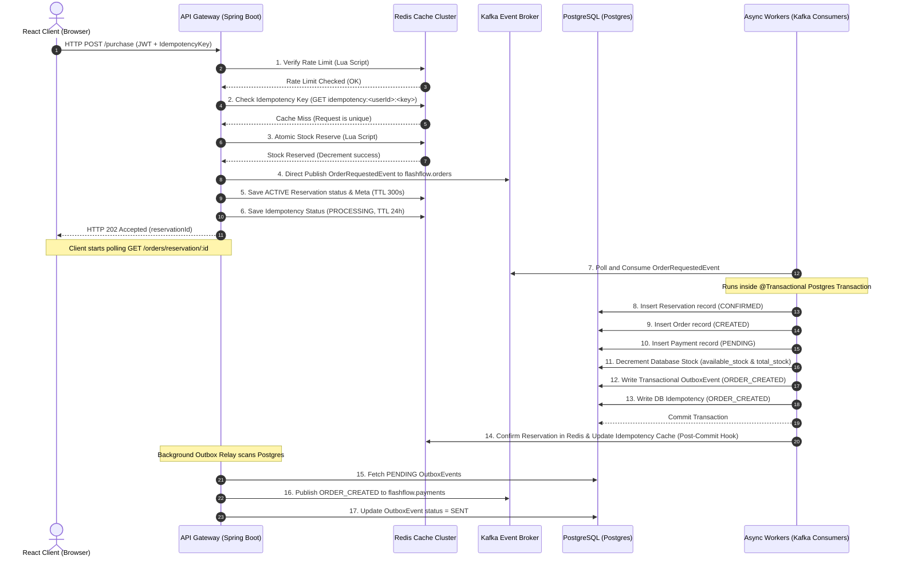

# FlashFlow: Redis & Kafka Technical Architecture & Implementation Report

This report provides a detailed, production-grade technical study of the caching and event-driven messaging layers in **FlashFlow**. It covers the design rationale, configuration details, connection handling, concurrency safeguards, failure recoveries, and common interview questions matching this specific implementation.

---

## 1. Architectural Blueprint & Request Flow

FlashFlow operates on a **hybrid synchronous/asynchronous write model** designed to decouple client connections from slow database writes and downstream integrations. By separating the checkout hot-path from the transaction processing engine, the platform scales to handle massive traffic spikes (up to 15,000 TPS) typical of high-demand flash sale events.

### End-to-End Transaction Lifecycle



---

## 2. Redis Caching & In-Memory Concurrency Engine

Redis 7 serves as our in-memory "entrance gate" and fast-path stock allocator. Because single-threaded database engines cannot cope with concurrent writes to hot-rows under high load, FlashFlow delegates rate-limiting, idempotency-checking, and inventory reserves entirely to Redis.

### A. Data Structures and Key Namespaces

| Key Pattern | Data Structure | TTL Strategy | Description / Rationale |
| :--- | :--- | :--- | :--- |
| `inventory:stock:<productId>` | **String** | Persistent / No Expiry | Stores the fast-path available inventory. Decremented atomically. |
| `ratelimit:<userId>` | **String** | Dynamic (10 seconds) | Tracks API requests per user per sliding window. |
| `user:<userId>:enabled` | **String** | 60 seconds | Caches user status to avoid repeating DB queries. |
| `product:<productId>:meta` | **String** | 60 seconds | Caches product price, active status, and association. |
| `reservation:<reservationId>` | **String** | 300 seconds (5 mins) | Stores active reservation status (e.g., `ACTIVE`, `CONFIRMED`). |
| `reservation:<reservationId>:meta`| **String** | 300 seconds (5 mins) | JSON metadata of reservation details, monitored by the reconciliation sweeper. |
| `idempotency:<userId>:<key>` | **String** | 86400 seconds (24 hours) | Caches API responses and execution states (`PROCESSING`, `COMPLETED`). |
| `active-sale-products` | **Set** | Persistent | Stores product IDs currently on active flash sales. |

### B. Connection Pooling & Lettuce Driver Mechanics
* **Driver Selection**: FlashFlow uses **Lettuce** (via `spring-boot-starter-data-redis`). Unlike Jedis, which relies on multi-threaded thread-per-connection patterns, Lettuce is built on **Netty** and shares a single thread-safe connection for all non-blocking operations.
* **Connection Pooling**: Configured via `commons-pool2` in `application-redis.properties`:
  ```properties
  spring.data.redis.lettuce.pool.max-active=32
  spring.data.redis.lettuce.pool.max-idle=16
  spring.data.redis.lettuce.pool.min-idle=8
  spring.data.redis.lettuce.pool.max-wait=3000ms
  ```
  *Rationale*: A dedicated connection pool is configured to prevent driver blocking during heavy transactional commands (such as executing Lua scripts) or high-concurrency connection spikes.

### C. The Redis Single-Threaded Event Loop & Netty
Redis utilizes a single-threaded event loop based on multiplexing I/O libraries (like `epoll` on Linux or `kqueue` on BSD). 
* **Netty Event Loop**: The Lettuce driver operates asynchronously over Netty channel loops. Commands sent by Spring Boot threads are serialized and queued in Netty's outbound event queue, then processed by the Redis server sequentially.
* **Why this prevents race conditions**: Since Redis processes commands sequentially on its single thread, no two commands can edit the same key at the identical physical millisecond. This guarantees absolute safety without requiring heavyweight locks in Java.

### D. Lua Scripting (Atomicity & Thread-Safety)

To prevent the classic **Read-Modify-Write race condition** (which causes database overselling), FlashFlow packages stock checking and decrementing into an atomic Lua script executed in `RedisInventoryService.java`:

```lua
local stock = redis.call('get', KEYS[1])
if not stock then
    return -1
end
stock = tonumber(stock)
local qty = tonumber(ARGV[1])
if stock >= qty then
    redis.call('decrby', KEYS[1], qty)
    return 1
else
    return 0
end
```

#### Code Execution flow:
1. `KEYS[1]` points to `inventory:stock:<productId>`. `ARGV[1]` is the requested quantity.
2. The script retrieves the stock value. If it does not exist, it returns `-1` (triggers lazy loading from the DB).
3. If the stock is greater than or equal to the requested quantity, `decrby` is called. It returns `1` (Success).
4. If stock is insufficient, it returns `0` (Rejected).
5. **Atomicity Guarantee**: Redis runs Lua scripts inside a transaction boundary. No other client command can execute while a Lua script is running, eliminating concurrency drift.

### E. Production Memory Eviction & Persistence Policies
* **Eviction Policy (`maxmemory-policy`)**: In production, the eviction policy must be set to **`noeviction`**.
  * *Why*: FlashFlow stores critical state machines (like active reservations and idempotency keys) inside Redis. If Redis encounters memory pressure and evicts an active reservation, the background reconciliation sweeper could leak stock.
* **Persistence Configuration**: 
  * **RDB (Redis Database Backup)**: Point-in-time snapshots (e.g. `save 900 1`) are write-efficient but risk losing up to 15 minutes of transactional data.
  * **AOF (Append Only File)**: Configured with `appendonly yes` and `appendfsync everysec`. Every write is logged to disk. Fsync occurs asynchronously every second, balancing durability and performance.
  * *FlashFlow Recommendation*: Enable both RDB and AOF. Use RDB for fast cluster restores and AOF (with everysec fsync) to ensure no more than 1 second of transactions are lost during server power loss.

---

## 3. Apache Kafka Event-Driven Messaging Layer

Apache Kafka functions as our high-throughput, asynchronous ingestion engine. By moving database locking writes to background consumers, we decouple client threads and prevent PostgreSQL table lock contention.

### A. Topics, Partitioning, and Consumer Concurrency

We configure three primary Kafka topics and two Dead Letter Topics (DLT) in [KafkaConfig.java](file:///d:/projects/flashflow/server/src/main/java/com/krushna/flashflow/config/KafkaConfig.java):

```java
@Bean
public NewTopic ordersTopic() {
    return TopicBuilder.name("flashflow.orders").partitions(8).replicas(1).build();
}
@Bean
public NewTopic paymentsTopic() {
    return TopicBuilder.name("flashflow.payments").partitions(8).replicas(1).build();
}
```

#### Kafka Layout Configuration:
* **Topic Partitions**: Both `flashflow.orders` and `flashflow.payments` are configured with **8 partitions**.
* **Key-Based Routing**:
  * In `PurchaseService.java`, the message key for `flashflow.orders` is `reservationId.toString()`.
  * In `OutboxPublisherScheduler.java`, the message key for `flashflow.payments` is `orderId.toString()`.
  * *Why Key-based Routing Matters*: Kafka guarantees that messages with the same key are routed to the **same partition**. This guarantees strict message processing order for any single reservation/order sequence.
* **Consumer Concurrency**: Configured with `concurrency = "8"` in `@KafkaListener`:
  ```java
  @KafkaListener(topics = "flashflow.orders", groupId = "flashflow-group", concurrency = "8")
  ```
  Spring boot spins up 8 independent message listener threads (one per partition), allowing parallel horizontal processing.

### B. Producer Configuration & Delivery Guarantees
* **Acknowledgments (`acks=all`)**: In production, producers are configured with `acks=all`. The leader broker waits for all in-sync replicas (ISRs) to acknowledge the message write before returning success, guaranteeing zero message loss.
* **Idempotent Producer**: Configured with `enable.idempotency=true`. Kafka tracks producer epoch and sequence numbers, ensuring duplicate network sends do not result in duplicate logs inside the partition.
* **Delivery Semantics**: We operate on **At-Least-Once Delivery** at the broker level. Consumers handle potential duplicate deliveries at the database transaction layer.

### C. Consumer Offset Commit Strategy
* **Commit Mode**: FlashFlow relies on Spring Kafka's default container-managed offset commits. The container automatically commits offsets after the listener thread executes successfully.
* **Transactional Integration**: If the consumer's PostgreSQL database transaction fails (e.g. database timeout), the Spring listener throws an exception, and the offset is **not committed**. The message remains on Kafka to be retried.

---

## 4. Resilience, Backup, & Failure Recovery Policies

High availability and crash recovery are baked directly into the code and configuration files.

### A. Redis Sentinel HA Cluster Configuration
Our Sentinel setup in `docker-compose.yml` runs a primary node (`redis-master`), a secondary node (`redis-slave`), and a monitoring instance (`redis-sentinel` on port 26379).
* **Sentinel Properties (`application-redis-sentinel.properties`)**:
  ```properties
  spring.data.redis.sentinel.master=mymaster
  spring.data.redis.sentinel.nodes=${SPRING_REDIS_SENTINEL_NODES:localhost:26379}
  ```
  *Failure Recovery Flow*: If `redis-master` crashes:
  1. Sentinel instances detect the heartbeat failure after `5000ms`.
  2. They run a quorum election and promote `redis-slave` to master.
  3. The Lettuce client listening to Sentinel events automatically updates its internal routing table to point to the new master, requiring no application restart.

### B. Hot-Path Direct-Publish Rollback Policy
During checkout, if the API server successfully decrements stock in Redis but the Kafka write fails, the system immediately executes a fallback in [PurchaseService.java](file:///d:/projects/flashflow/server/src/main/java/com/krushna/flashflow/order/PurchaseService.java#L215-L226):

```java
try {
    kafkaTemplate.send(record);
} catch (Exception e) {
    log.error("Failed to publish to Kafka. Releasing stock in Redis...", e);
    redisInventoryService.releaseStock(productId, quantity); // Redis rollback
    throw new RuntimeException("Kafka publish failed", e);
}
```
This guarantees that stock is immediately restored in Redis if the ingestion pipeline is compromised.

### C. Database Lock Jitter Retry Policy
When 8 concurrent Kafka threads try to write to PostgreSQL, optimistic lock conflicts (`OptimisticLockingFailureException`) can abort transactions.
* **Solution (Jittered Backoff)**: [OrderRequestedConsumer.java](file:///d:/projects/flashflow/server/src/main/java/com/krushna/flashflow/order/kafka/OrderRequestedConsumer.java#L60-L76) implements a manual retry loop:
  ```java
  int attempts = 0;
  while (true) {
      attempts++;
      try {
          orderFulfillmentService.fulfillOrder(event);
          break;
      } catch (OptimisticLockingFailureException e) {
          if (attempts >= 10) throw e;
          Thread.sleep(30 + new java.util.Random().nextInt(40)); // Random jitter backoff
      }
  }
  ```
  Adding random jitter prevents threads from retrying at the same physical instant, allowing write collisions to resolve gracefully.

### D. Dead Letter Queue/Topic (DLQ) Recovery Policy
Poison pill events (e.g. data formatting errors) that fail repeatedly block consumer partitions.
* **DLQ Routing**: Configured in [KafkaConfig.java](file:///d:/projects/flashflow/server/src/main/java/com/krushna/flashflow/config/KafkaConfig.java#L57-L60):
  ```java
  @Bean
  public CommonErrorHandler errorHandler(KafkaTemplate<String, String> template) {
      DeadLetterPublishingRecoverer recoverer = new DeadLetterPublishingRecoverer(template);
      return new DefaultErrorHandler(recoverer, new FixedBackOff(1000L, 2L)); // 2 retries
  }
  ```
  If a consumer thread encounters an error, it retries up to 2 times (1 second apart). On the third failure, it routes the message to the corresponding DLT (e.g. `flashflow.orders.DLT`), allowing partition execution to continue.
* **Monitoring**: Admin can view DLT logs via the `/admin/dlt/stats` endpoint.

### E. Background Orphan Reconciliation Scheduler
If a node crashes *after* reserving Redis stock but *before* publishing to Kafka, the stock is leaked.
* **The Reconciliation Flow ([ReservationReconciliationScheduler.java](file:///d:/projects/flashflow/server/src/main/java/com/krushna/flashflow/reservation/ReservationReconciliationScheduler.java))**:
  1. Every 30 seconds, the scheduler scans all active Redis metadata keys `reservation:*:meta`.
  2. If a reservation is older than a 15-second grace window, the scheduler queries PostgreSQL.
  3. If present in PostgreSQL, the Redis state is synced to `CONFIRMED`.
  4. If NOT present in PostgreSQL (an orphan), it republishes the event to Kafka (up to 3 times).
  5. If reconciliation fails after 3 sweeps, the reservation is expired, and stock is returned back to Redis.

---

## 5. Architectural Trade-offs & Selection Rationale

### Redis vs. Alternatives
* **Why Redis over Memcached?** Memcached is excellent for simple key-value lookups, but lacks support for advanced data structures (Sets, Hashes) and server-side scripting (Lua). FlashFlow requires Lua scripting to ensure atomic inventory decrements.
* **Why Redis over Database-level Pessimistic Locking (`SELECT FOR UPDATE`)?** Pessimistic locks block database connections. Under 5,000 concurrent checkout requests, PostgreSQL connection pools exhaust quickly, leading to server crashes and latency spikes. Redis holds inventory in memory and processes over 100,000 requests/sec with sub-millisecond latencies.

### Kafka vs. Alternatives
* **Why Kafka over RabbitMQ?** RabbitMQ is a message broker that deletes messages immediately after consumption. Kafka is an append-only commit log that persists messages. This persistent log enables:
  1. **Replayability**: If consumers crash, messages can be reprocessed from any offset.
  2. **High Ingestion Throughput**: Kafka handles millions of messages/sec via sequential disk writes and page caching.
  3. **Decoupled Downstream Consumption**: The same checkout event can be consumed independently by order fulfillment, analytics, and messaging queues.

### Trade-Offs of the Chosen Architecture
* **Eventual Consistency**: Because inventory is reserved in Redis and written asynchronously to Postgres, the database is eventually consistent. This introduces short periods where the database inventory lags behind the actual reservation pool.
* **Operational Complexity**: Introducing Sentinel clusters, Kafka topics, outbox schedulers, and recovery worker scripts increases system administration overhead.

---

## 6. Project-Specific Resume & Interview Prep Q&A

Highlight these answers during technical interviews to showcase your deep system design skills.

### Q1: How does FlashFlow guarantee that products are not oversold under high concurrency?
**Answer**: Overselling is prevented at the entry gate via Redis Lua scripting. When a checkout request hits `/purchase`, a Lua script executes atomically within Redis's single thread. The script reads the inventory key, verifies that the available stock is greater than or equal to the requested quantity, and decrements it. If stock is insufficient, it rejects the request instantly in memory. Because Lua scripts execute atomically, race conditions are mathematically impossible.

### Q2: Why did you bypass the Transactional Outbox Pattern on the `/purchase` API path, but kept it for downstream fulfillment?
**Answer**: Bypassing PostgreSQL on the `/purchase` API path was an intentional performance design decision. Writing to database tables (like `outbox_events`) synchronously during checkout introduces write latency and disk I/O bottlenecks, capping our throughput. Instead, we publish checkout events directly to Kafka and write transient metadata to Redis. 
Downstream, where the transaction is already open for order and payment writes, we use the Transactional Outbox Pattern to guarantee that the subsequent events (`ORDER_CREATED` or `RESERVATION_EXPIRED`) are published reliably to downstream systems (e.g. payment/reporting) without risking dual-write failures.

### Q3: How do you handle transient failures during Kafka event consumption (e.g., database lock failures)?
**Answer**: Concurrency at the Kafka consumer layer causes PostgreSQL write conflicts, throwing `OptimisticLockingFailureException`. We catch this exception inside the consumer loop and retry the transaction up to 10 times. To prevent retrying threads from colliding again, we introduce randomized jitter backoff (sleeping between 30ms and 70ms). If a message fails due to non-transient issues (poison pills), Spring's `CommonErrorHandler` routes it to a Dead Letter Topic (`flashflow.orders.DLT`) after 3 failed attempts, preventing partition blockage.

### Q4: What happens if an API server crashes immediately after reserving stock in Redis, but before publishing to Kafka?
**Answer**: This represents an orphan reservation failure, which would normally leak stock. We solve this through our **Reservation Reconciliation Scheduler**. Every 30 seconds, a background job scans Redis for active reservation metadata. If it finds an active reservation older than 15 seconds, it queries Postgres. If the record is missing from PostgreSQL, it republishes the reservation event to Kafka. If reconciliation fails after 3 attempts, the scheduler cancels the reservation in Redis and increments the stock back to the pool.

### Q5: How is Redis High Availability configured in this project?
**Answer**: We implement **Redis Sentinel** replication. The Sentinel cluster monitors a master node and replica nodes. If the master node goes down, Sentinel triggers an automatic failover, promoting a replica to master. The Lettuce driver in Spring Boot listens to Sentinel events and automatically updates its connections without requiring an application restart.

### Q6: How does the platform ensure idempotency for checkout requests?
**Answer**: Idempotency is verified at two levels:
1. **Redis Cache (Fast Path)**: The incoming `idempotencyKey` is checked against Redis. If it exists and has a status of `PROCESSING` or `ORDER_CREATED`, a conflict response is returned. If it is `COMPLETED`, the cached response snapshot is returned directly to the client.
2. **PostgreSQL DB (Final Guard)**: The `idempotency` table records the completed states. If a cache miss occurs in Redis due to cache eviction, the database unique key constraints prevent duplicate inserts and trigger an atomic fallback.
