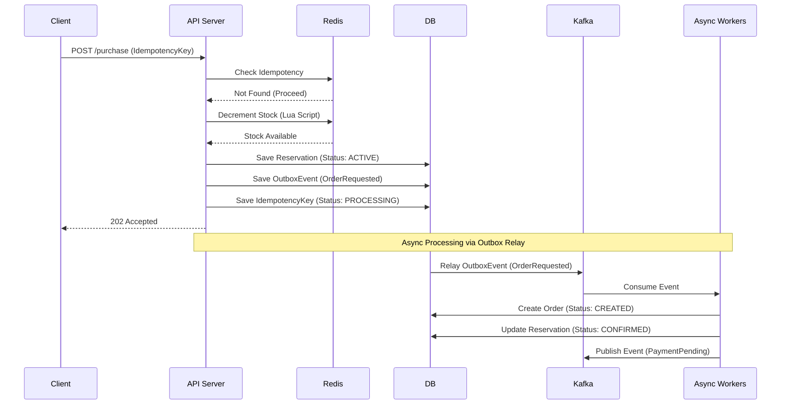
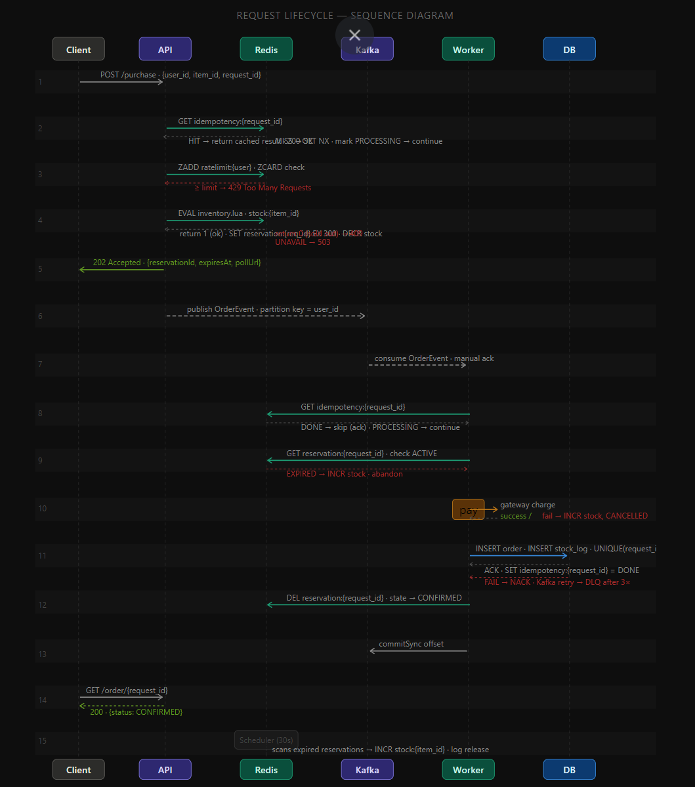

# FlashFlow Workflow

This document details the standard request flow and asynchronous processing workflows in FlashFlow.

## High-Level Request Flow

1. **Client Request**: Client calls `POST /purchase` with `userId`, `productId`, `quantity`, and an `idempotencyKey`.
2. **Idempotency Check**: System checks Redis/DB for the `idempotencyKey`. If it exists, return the cached response.
3. **Rate Limiting**: Check if the user has exceeded their request limit in Redis.
4. **Stock Reservation**: 
    * System tries to decrement the available stock in Redis atomically.
    * If successful, a `Reservation` is created in DB (Pending).
5. **Async Processing Initiation**:
    * An `OutboxEvent` (e.g., `OrderRequestedEvent`) is saved in the DB transaction.
    * The API returns `202 Accepted` to the client.

## Sequence Diagram

