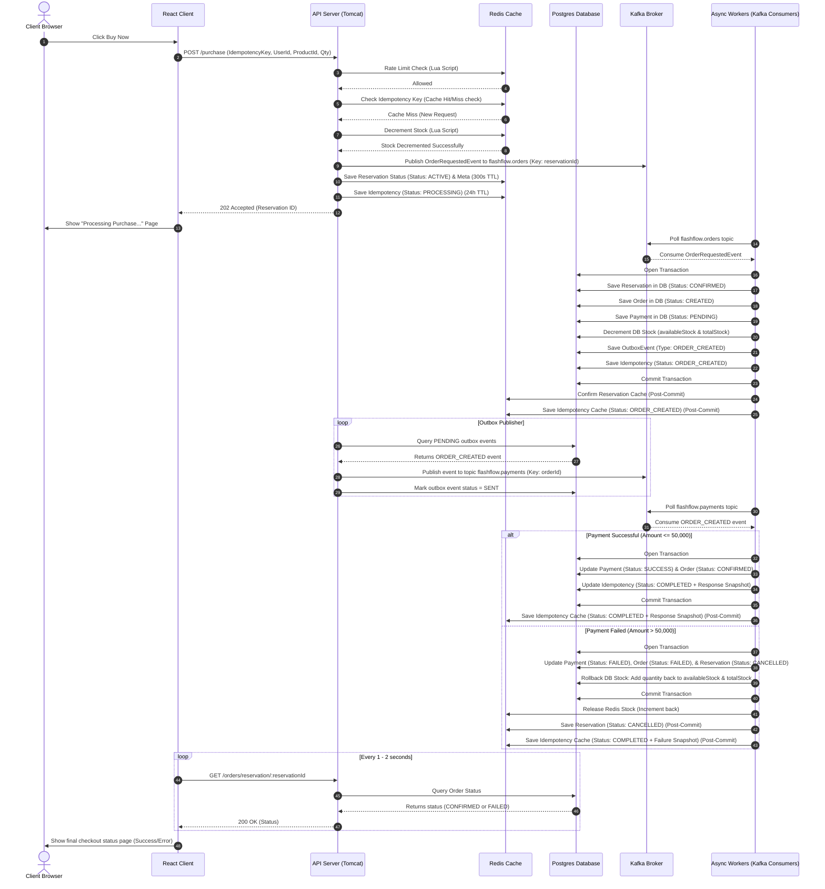

# FlashFlow Workflow

This document details the standard request flow and asynchronous processing workflows in FlashFlow.

## High-Level Request Flow

1. **Client Request**: Client calls `POST /purchase` with `userId`, `productId`, `quantity`, and an `idempotencyKey`.
2. **Idempotency Check**: System checks Redis/DB for the `idempotencyKey`. If it exists, return the cached response.
3. **Rate Limiting**: Check if the user has exceeded their request limit in Redis.
4. **Stock Reservation**: 
    * System tries to decrement the available stock in Redis atomically via Lua scripting.
    * If successful, the reservation status is written to Redis (`ACTIVE`). PostgreSQL is bypassed to maximize write throughput.
5. **Async Processing Initiation**:
    * An `OrderRequestedEvent` is published directly to Kafka topic `flashflow.orders`.
    * The API returns `202 Accepted` to the client containing the `reservationId`.
6. **Client Polling**:
    * The client immediately redirects to `/purchase/:reservationId/status` and begins polling the backend for final order booking status.

---

## Complete End-to-End Sequence Diagram

```mermaid
sequenceDiagram
    autonumber
    actor User as Client Browser
    participant Client as React Client
    participant API as API Server (Tomcat)
    participant Redis as Redis Cache
    participant DB as Postgres Database
    participant Kafka as Kafka Broker
    participant Worker as Async Workers (Kafka Consumers)

    %% Step 1: Initial API Call
    User->>Client: Click Buy Now
    Client->>API: POST /purchase (IdempotencyKey, UserId, ProductId, Qty)
    
    %% Step 2: Entrance Gate Validations (Redis Fast Path)
    API->>Redis: Rate Limit Check (Lua Script)
    Redis-->>API: Allowed
    API->>Redis: Check Idempotency Key (Cache Hit/Miss check)
    Redis-->>API: Cache Miss (New Request)
    API->>Redis: Decrement Stock (Lua Script)
    Redis-->>API: Stock Decremented Successfully
    
    %% Step 3: Fast Redis Transaction & Direct Kafka Publish (No DB write on hot-path)
    API->>Kafka: Publish OrderRequestedEvent to flashflow.orders (Key: reservationId)
    API->>Redis: Save Reservation Status (Status: ACTIVE) & Meta (300s TTL)
    API->>Redis: Save Idempotency (Status: PROCESSING) (24h TTL)
    
    %% Step 4: Immediate 202 Accepted Response
    API-->>Client: 202 Accepted (Reservation ID)
    Client->>User: Show "Processing Purchase..." Page
    
    %% Step 5: Order Fulfillment Worker
    Worker->>Kafka: Poll flashflow.orders topic
    Kafka-->>Worker: Consume OrderRequestedEvent
    Worker->>DB: Open Transaction
    Worker->>DB: Save Reservation in DB (Status: CONFIRMED)
    Worker->>DB: Save Order in DB (Status: CREATED)
    Worker->>DB: Save Payment in DB (Status: PENDING)
    Worker->>DB: Decrement DB Stock (availableStock & totalStock)
    Worker->>DB: Save OutboxEvent (Type: ORDER_CREATED)
    Worker->>DB: Save Idempotency (Status: ORDER_CREATED)
    Worker->>DB: Commit Transaction
    Worker->>Redis: Confirm Reservation Cache (Post-Commit)
    Worker->>Redis: Save Idempotency Cache (Status: ORDER_CREATED) (Post-Commit)
    
    %% Step 6: Asynchronous Event Relay
    loop Outbox Publisher
        API->>DB: Query PENDING outbox events
        DB-->>API: Returns ORDER_CREATED event
        API->>Kafka: Publish event to topic flashflow.payments (Key: orderId)
        API->>DB: Mark outbox event status = SENT
    end

    %% Step 7: Payment Fulfillment Worker
    Worker->>Kafka: Poll flashflow.payments topic
    Kafka-->>Worker: Consume ORDER_CREATED event
    
    alt Payment Successful (Amount <= 50,000)
        Worker->>DB: Open Transaction
        Worker->>DB: Update Payment (Status: SUCCESS) & Order (Status: CONFIRMED)
        Worker->>DB: Update Idempotency (Status: COMPLETED + Response Snapshot)
        Worker->>DB: Commit Transaction
        Worker->>Redis: Save Idempotency Cache (Status: COMPLETED + Response Snapshot) (Post-Commit)
    else Payment Failed (Amount > 50,000)
        Worker->>DB: Open Transaction
        Worker->>DB: Update Payment (Status: FAILED), Order (Status: FAILED), & Reservation (Status: CANCELLED)
        Worker->>DB: Rollback DB Stock: Add quantity back to availableStock & totalStock
        Worker->>DB: Commit Transaction
        Worker->>Redis: Release Redis Stock (Increment back)
        Worker->>Redis: Save Reservation (Status: CANCELLED) (Post-Commit)
        Worker->>Redis: Save Idempotency Cache (Status: COMPLETED + Failure Snapshot) (Post-Commit)
    end

    %% Step 8: Client Polling Loop
    loop Every 1 - 2 seconds
        Client->>API: GET /orders/reservation/:reservationId
        API->>DB: Query Order Status
        DB-->>API: Returns status (CONFIRMED or FAILED)
        API-->>Client: 200 OK (Status)
    end
    Client->>User: Show final checkout status page (Success/Error)
```