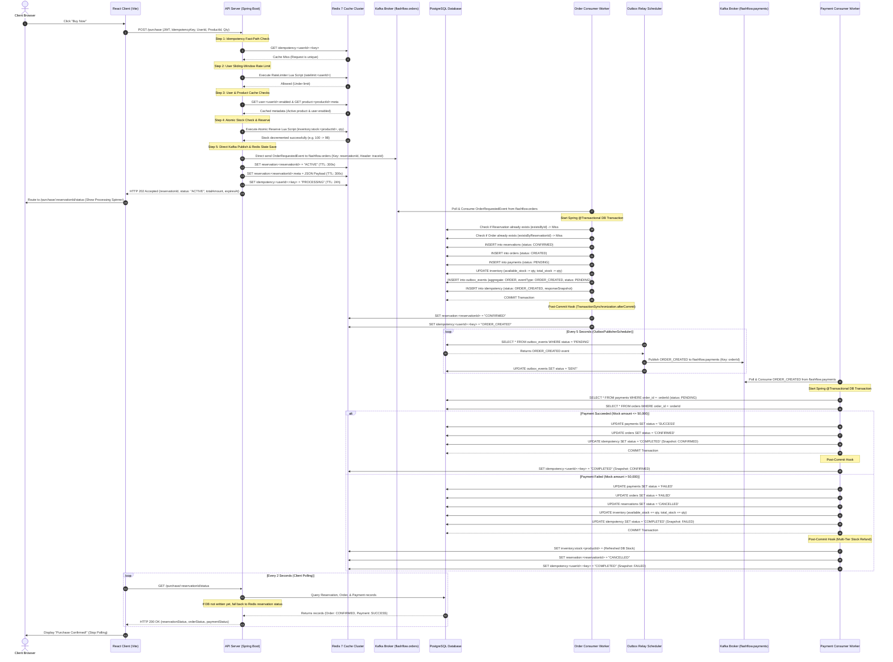

# FlashFlow: Comprehensive End-to-End Workflow & Execution Architecture

This document details the exact, production-grade request execution lifecycle and asynchronous processing workflows in **FlashFlow**. It covers every step under the hood: entrance gate validations, atomic in-memory stock reservations, direct message broker dispatches, database fulfillment transactions, Transactional Outbox event relays, payment state machines, client polling resolution, and background self-healing reconciliations.

---

## 1. Architectural Philosophy & Workflow Overview

FlashFlow operates on an **Asymmetric Write Architecture** designed to sustain massive traffic bursts (10,000+ requests per second) during flash sale events:

1. **Synchronous Fast Path (API Tier)**: Decoupled entirely from PostgreSQL. State checks, user rate-limiting, and atomic inventory reservations occur entirely in **Redis 7**, followed by direct event emission to **Apache Kafka**. The API returns `HTTP 202 Accepted` to the client in sub-milliseconds.
2. **Asynchronous Fulfillment Tier (Worker Engine)**: Dedicated Kafka consumer worker pools consume reservation events, execute ACID transactional updates against **PostgreSQL**, insert downstream **Transactional Outbox** events, and synchronize final states back to Redis via post-commit transaction synchronization hooks.
3. **Autonomous Reconciliation Tier (Background Schedulers)**: Self-healing background daemons cross-check data consistency across Redis and PostgreSQL, resolve stuck transactions, republish orphaned events, and clean expired reservations.

---

## 2. Complete End-to-End Sequence Diagram


```mermaid
sequenceDiagram
    autonumber
    actor User as Client Browser
    participant Client as React Client (Vite)
    participant API as API Server (Spring Boot)
    participant Redis as Redis 7 Cache Cluster
    participant Kafka as Kafka Broker (flashflow.orders)
    participant DB as PostgreSQL Database
    participant OrderWorker as Order Consumer Worker
    participant OutboxRelay as Outbox Relay Scheduler
    participant KafkaPay as Kafka Broker (flashflow.payments)
    participant PayWorker as Payment Consumer Worker

    %% Phase 1: Ingestion & Fast-Path Hot Checkout
    User->>Client: Click "Buy Now"
    Client->>API: POST /purchase (JWT, IdempotencyKey, UserId, ProductId, Qty)
    
    Note over API: Step 1: Idempotency Fast-Path Check
    API->>Redis: GET idempotency:<userId>:<key>
    Redis-->>API: Cache Miss (Request is unique)
    
    Note over API: Step 2: User Sliding-Window Rate Limit
    API->>Redis: Execute RateLimiter Lua Script (ratelimit:<userId>)
    Redis-->>API: Allowed (Under limit)
    
    Note over API: Step 3: User & Product Cache Checks
    API->>Redis: GET user:<userId>:enabled & GET product:<productId>:meta
    Redis-->>API: Cached metadata (Active product & user enabled)
    
    Note over API: Step 4: Atomic Stock Check & Reserve
    API->>Redis: Execute Atomic Reserve Lua Script (inventory:stock:<productId>, qty)
    Redis-->>API: Stock decremented successfully (e.g. 100 -> 98)
    
    Note over API: Step 5: Direct Kafka Publish & Redis State Save
    API->>Kafka: Direct send OrderRequestedEvent to flashflow.orders (Key: reservationId, Header: traceId)
    API->>Redis: SET reservation:<reservationId> = "ACTIVE" (TTL: 300s)
    API->>Redis: SET reservation:<reservationId>:meta = JSON Payload (TTL: 300s)
    API->>Redis: SET idempotency:<userId>:<key> = "PROCESSING" (TTL: 24h)
    
    API-->>Client: HTTP 202 Accepted (reservationId, status: "ACTIVE", totalAmount, expiresAt)
    Client->>User: Route to /purchase/:reservationId/status (Show Processing Spinner)

    %% Phase 2: Asynchronous Order Fulfillment Worker
    OrderWorker->>Kafka: Poll & Consume OrderRequestedEvent from flashflow.orders
    Note over OrderWorker: Start Spring @Transactional DB Transaction
    OrderWorker->>DB: Check if Reservation already exists (existsById) -> Miss
    OrderWorker->>DB: Check if Order already exists (existsByReservationId) -> Miss
    OrderWorker->>DB: INSERT into reservations (status: CONFIRMED)
    OrderWorker->>DB: INSERT into orders (status: CREATED)
    OrderWorker->>DB: INSERT into payments (status: PENDING)
    OrderWorker->>DB: UPDATE inventory (available_stock -= qty, total_stock -= qty)
    OrderWorker->>DB: INSERT into outbox_events (aggregate: ORDER, eventType: ORDER_CREATED, status: PENDING)
    OrderWorker->>DB: INSERT into idempotency (status: ORDER_CREATED, responseSnapshot)
    OrderWorker-->>DB: COMMIT Transaction
    
    Note over OrderWorker: Post-Commit Hook (TransactionSynchronization.afterCommit)
    OrderWorker->>Redis: SET reservation:<reservationId> = "CONFIRMED"
    OrderWorker->>Redis: SET idempotency:<userId>:<key> = "ORDER_CREATED"

    %% Phase 3: Transactional Outbox Event Relay
    loop Every 5 Seconds (OutboxPublisherScheduler)
        OutboxRelay->>DB: SELECT * FROM outbox_events WHERE status = 'PENDING'
        DB-->>OutboxRelay: Returns ORDER_CREATED event
        OutboxRelay->>KafkaPay: Publish ORDER_CREATED to flashflow.payments (Key: orderId)
        OutboxRelay->>DB: UPDATE outbox_events SET status = 'SENT'
    end

    %% Phase 4: Asynchronous Payment Fulfillment Worker
    PayWorker->>KafkaPay: Poll & Consume ORDER_CREATED from flashflow.payments
    Note over PayWorker: Start Spring @Transactional DB Transaction
    PayWorker->>DB: SELECT * FROM payments WHERE order_id = :orderId (status: PENDING)
    PayWorker->>DB: SELECT * FROM orders WHERE order_id = :orderId
    
    alt Payment Succeeded (Mock amount <= 50,000)
        PayWorker->>DB: UPDATE payments SET status = 'SUCCESS'
        PayWorker->>DB: UPDATE orders SET status = 'CONFIRMED'
        PayWorker->>DB: UPDATE idempotency SET status = 'COMPLETED' (Snapshot: CONFIRMED)
        PayWorker-->>DB: COMMIT Transaction
        Note over PayWorker: Post-Commit Hook
        PayWorker->>Redis: SET idempotency:<userId>:<key> = "COMPLETED" (Snapshot: CONFIRMED)
    else Payment Failed (Mock amount > 50,000)
        PayWorker->>DB: UPDATE payments SET status = 'FAILED'
        PayWorker->>DB: UPDATE orders SET status = 'FAILED'
        PayWorker->>DB: UPDATE reservations SET status = 'CANCELLED'
        PayWorker->>DB: UPDATE inventory (available_stock += qty, total_stock += qty)
        PayWorker->>DB: UPDATE idempotency SET status = 'COMPLETED' (Snapshot: FAILED)
        PayWorker-->>DB: COMMIT Transaction
        Note over PayWorker: Post-Commit Hook (Multi-Tier Stock Refund)
        PayWorker->>Redis: SET inventory:stock:<productId> = (Refreshed DB Stock)
        PayWorker->>Redis: SET reservation:<reservationId> = "CANCELLED"
        PayWorker->>Redis: SET idempotency:<userId>:<key> = "COMPLETED" (Snapshot: FAILED)
    end

    %% Phase 5: Client Polling Resolution
    loop Every 2 Seconds (Client Polling)
        Client->>API: GET /purchase/:reservationId/status
        API->>DB: Query Reservation, Order, & Payment records
        Note over API: If DB not written yet, fall back to Redis reservation status
        DB-->>API: Returns records (Order: CONFIRMED, Payment: SUCCESS)
        API-->>Client: HTTP 200 OK (reservationStatus, orderStatus, paymentStatus)
    end
    Client->>User: Display "Purchase Confirmed!" (Stop Polling)
```

---

## 3. Phase-by-Phase Under-The-Hood Breakdown

### Phase 1: Ingestion & Fast-Path Hot Checkout (`POST /purchase`)
Handled by [PurchaseController.java](file:///d:/projects/flashflow/server/src/main/java/com/krushna/flashflow/order/PurchaseController.java) and [PurchaseService.java](file:///d:/projects/flashflow/server/src/main/java/com/krushna/flashflow/order/PurchaseService.java).

1. **Request Intake & Authentication**:
   - The React client sends a JSON payload: `userId`, `productId`, `quantity`, and a unique UUID `idempotencyKey`.
   - The [JwtAuthenticationFilter.java](file:///d:/projects/flashflow/server/src/main/java/com/krushna/flashflow/config/JwtAuthenticationFilter.java) validates the Bearer JWT token, setting the security context.
2. **Fast-Path Idempotency Evaluation ([Lines 75–87](file:///d:/projects/flashflow/server/src/main/java/com/krushna/flashflow/order/PurchaseService.java#L75-L87))**:
   - The API inspects Redis key `idempotency:<userId>:<key>`:
     - If status is `PROCESSING` or `ORDER_CREATED`: Throws `IllegalStateException("Request is currently being processed.")` which returns `HTTP 409 Conflict`.
     - If status is `COMPLETED`: Deserializes the cached `responseSnapshot` and immediately returns the previously completed purchase response, bypassing all downstream operations.
     - If `null` (Cache Miss): Execution continues.
3. **Sliding-Window Rate Limiting ([Lines 90–94](file:///d:/projects/flashflow/server/src/main/java/com/krushna/flashflow/order/PurchaseService.java#L90-L94))**:
   - [RateLimiterService.java](file:///d:/projects/flashflow/server/src/main/java/com/krushna/flashflow/inventory/redis/RateLimiterService.java) executes an atomic Redis Lua script against key `ratelimit:<userId>`.
   - Checks whether the count in the current 10-second sliding window exceeds the configured limit (default: 5 requests). If exceeded, throws an exception returning `HTTP 429 Too Many Requests`.
4. **User & Product Metadata Caching ([Lines 97–150](file:///d:/projects/flashflow/server/src/main/java/com/krushna/flashflow/order/PurchaseService.java#L97-L150))**:
   - **User Validation**: Looks up `user:<userId>:enabled` (TTL: 60s). On miss, queries DB and caches result. If user is disabled, rejects with `HTTP 400`.
   - **Product Validation**: Looks up `product:<productId>:meta` (price, status, flash sale association; TTL: 60s). Rejects if status is not `ACTIVE`.
   - **Flash Sale Validation**: Validates against Redis Set `active-sale-products` via [FlashSaleService.java](file:///d:/projects/flashflow/server/src/main/java/com/krushna/flashflow/inventory/FlashSaleService.java).
5. **Redis Stock Check & Lazy Loading ([Lines 153–163](file:///d:/projects/flashflow/server/src/main/java/com/krushna/flashflow/order/PurchaseService.java#L153-L163))**:
   - Queries `inventory:stock:<productId>`.
   - If `null` (cold key), queries PostgreSQL for `availableStock` and executes `setStockIfAbsent(productId, stock)` (`SETNX`) to prevent concurrency overwrite races.
6. **Atomic In-Memory Stock Reservation ([Lines 166–170](file:///d:/projects/flashflow/server/src/main/java/com/krushna/flashflow/order/PurchaseService.java#L166-L170))**:
   - Executes atomic Lua script in [RedisInventoryService.java](file:///d:/projects/flashflow/server/src/main/java/com/krushna/flashflow/inventory/redis/RedisInventoryService.java#L45-L57):
     ```lua
     local stock = redis.call('get', KEYS[1])
     if not stock then return -1 end
     stock = tonumber(stock)
     local qty = tonumber(ARGV[1])
     if stock >= qty then
         redis.call('decrby', KEYS[1], qty)
         return 1
     else
         return 0
     end
     ```
   - If stock is insufficient, returns `0` and rejects with `HTTP 400 Bad Request ("Insufficient stock available")`.
7. **Direct Kafka Event Emission & In-Flight Rollback ([Lines 215–226](file:///d:/projects/flashflow/server/src/main/java/com/krushna/flashflow/order/PurchaseService.java#L215-L226))**:
   - Generates a UUID `reservationId`.
   - Builds `OrderRequestedEvent` and serializes it to JSON.
   - Publishes to Kafka topic `flashflow.orders` using `reservationId.toString()` as the partition routing key and attaching a custom `traceId` byte header.
   - **Rollback Safety Net**: If `kafkaTemplate.send()` throws an exception, the `catch` block immediately calls `redisInventoryService.releaseStock(productId, quantity)` to refund the stock in Redis before rethrowing the exception.
8. **Redis State & Metadata Persistence ([Lines 228–232](file:///d:/projects/flashflow/server/src/main/java/com/krushna/flashflow/order/PurchaseService.java#L228-L232))**:
   - Sets `reservation:<reservationId>` = `ACTIVE` with a TTL of 300 seconds (5 minutes).
   - Sets `reservation:<reservationId>:meta` = JSON metadata ([RedisReservationMeta](file:///d:/projects/flashflow/server/src/main/java/com/krushna/flashflow/reservation/RedisReservationMeta.java)) for the reconciliation sweeper.
   - Sets `idempotency:<userId>:<key>` = `PROCESSING` with a TTL of 86400 seconds (24 hours).
9. **Dispatch `HTTP 202 Accepted`**:
   - Returns [PurchaseResponseDto](file:///d:/projects/flashflow/server/src/main/java/com/krushna/flashflow/order/PurchaseResponseDto.java) (`reservationId`, `status: "ACTIVE"`, `totalAmount`, `expiresAt`).

---

### Phase 2: Asynchronous Order Fulfillment Worker (`flashflow.orders`)
Handled by [OrderRequestedConsumer.java](file:///d:/projects/flashflow/server/src/main/java/com/krushna/flashflow/order/kafka/OrderRequestedConsumer.java) and [OrderFulfillmentService.java](file:///d:/projects/flashflow/server/src/main/java/com/krushna/flashflow/order/OrderFulfillmentService.java).

1. **Ingestion & Concurrency Allocation**:
   - `@KafkaListener(topics = "flashflow.orders", groupId = "flashflow-group", concurrency = "8")`.
   - 8 parallel consumer threads process events partitioned by `reservationId`.
2. **Optimistic Locking Retry Loop ([Lines 60–76](file:///d:/projects/flashflow/server/src/main/java/com/krushna/flashflow/order/kafka/OrderRequestedConsumer.java#L60-L76))**:
   - Catches `OptimisticLockingFailureException` during database write collisions.
   - Retries up to **10 times** with randomized jitter sleep (`30ms + random(40ms)`).
3. **Database Transaction Boundary (`@Transactional`)**:
   - **Idempotency Guard**: Queries `reservationRepository.findById(reservationId)` and `orderRepository.existsByReservationId(reservationId)`. If present, exits immediately without duplicate fulfillment.
   - **Insert Reservation**: Saves `Reservation` entity with status `CONFIRMED`.
   - **Insert Order**: Saves `Order` entity with status `CREATED` and generated `orderId`.
   - **Insert Payment**: Saves `Payment` entity with status `PENDING` linked to `orderId`.
   - **Atomic DB Inventory Decrement**: Executes atomic SQL query in [InventoryRepository.java](file:///d:/projects/flashflow/server/src/main/java/com/krushna/flashflow/inventory/InventoryRepository.java):
     ```sql
     UPDATE inventory 
     SET available_stock = available_stock - :quantity, 
         total_stock = total_stock - :quantity, 
         version = version + 1 
     WHERE product_id = :productId AND available_stock >= :quantity
     ```
   - **Insert Transactional Outbox Event**: Saves `OutboxEvent` with `aggregateType = "ORDER"`, `eventType = "ORDER_CREATED"`, payload = serialized `Order`, and `status = PENDING`.
   - **Insert Idempotency Record**: Saves `Idempotency` in PostgreSQL with status `ORDER_CREATED` and response snapshot.
4. **Post-Commit Synchronization Hook ([Lines 162–194](file:///d:/projects/flashflow/server/src/main/java/com/krushna/flashflow/order/OrderFulfillmentService.java#L162-L194))**:
   - Registers a `TransactionSynchronization.afterCommit()` callback:
     - Updates Redis reservation status: `reservation:<reservationId>` = `CONFIRMED`.
     - Updates Redis idempotency cache: `idempotency:<userId>:<key>` = `ORDER_CREATED`.

---

### Phase 3: Transactional Outbox Event Relay (`OutboxPublisherScheduler`)
Handled by [OutboxPublisherScheduler.java](file:///d:/projects/flashflow/server/src/main/java/com/krushna/flashflow/common/OutboxPublisherScheduler.java).

1. **Periodic Scan**:
   - Runs every **5000ms** (`@Scheduled(fixedDelay = 5000)`).
   - Fetches pending outbox events where `status = PENDING`.
2. **Topic Routing**:
   - Events with aggregate type `ORDER` or `PAYMENT` are routed to Kafka topic `flashflow.payments`.
   - Events with aggregate type `RESERVATION` are routed to `flashflow.reservations`.
   - `ORDER_REQUESTED` events are bypassed (since they are handled directly on the hot path).
3. **Asynchronous Send & Delivery Guarantee**:
   - Uses `CompletableFuture` to publish to Kafka using `aggregateId.toString()` as the partition key.
   - On success: Calls `outboxService.markAsSent(eventId)` (`status = SENT`).
   - On failure: Increments `retryCount`. If `retryCount >= 3`, transitions event status to `FAILED`.

---

### Phase 4: Asynchronous Payment Fulfillment Worker (`flashflow.payments`)
Handled by [PaymentRequestedConsumer.java](file:///d:/projects/flashflow/server/src/main/java/com/krushna/flashflow/payment/kafka/PaymentRequestedConsumer.java) and [PaymentFulfillmentService.java](file:///d:/projects/flashflow/server/src/main/java/com/krushna/flashflow/payment/PaymentFulfillmentService.java).

1. **Ingestion & Deserialization**:
   - Consumes `ORDER_CREATED` event from `flashflow.payments` topic with `concurrency = "8"`.
2. **Database Transaction Boundary (`@Transactional`)**:
   - Fetches `Payment` by `orderId`, confirming status is `PENDING`.
   - Fetches corresponding `Order` entity.
   - Executes payment processing via [PaymentService.java](file:///d:/projects/flashflow/server/src/main/java/com/krushna/flashflow/payment/PaymentService.java) *(Deterministic mock: amounts $\le$ 50,000 succeed; amounts > 50,000 fail)*.
3. **Branch A: Payment Success**:
   - Sets `Payment.status = SUCCESS` and `Order.status = CONFIRMED`.
   - Updates DB `Idempotency.status = COMPLETED` with response snapshot `"CONFIRMED"`.
   - In post-commit hook: Updates Redis idempotency cache to `COMPLETED`.
4. **Branch B: Payment Failure & Multi-Tier Stock Rollback**:
   - Sets `Payment.status = FAILED` and `Order.status = FAILED`.
   - Updates `Reservation.status = CANCELLED` in PostgreSQL.
   - **Atomic Database Stock Refund**: Executes `inventoryRepository.incrementStock(productId, quantity)` (`availableStock += qty`, `totalStock += qty`).
   - Updates DB `Idempotency.status = COMPLETED` with response snapshot `"FAILED"`.
   - **Post-Commit Hook Execution**:
     - Queries updated available stock from DB and syncs it to Redis via `redisInventoryService.setStock(productId, availableStock)`.
     - Updates Redis reservation key to `CANCELLED`.
     - Updates Redis idempotency cache to `COMPLETED` with failure snapshot.

---

### Phase 5: Client Polling & Real-Time Status Resolution
Handled by [PurchaseStatus.jsx](file:///d:/projects/flashflow/client/src/pages/PurchaseStatus.jsx) and [OrderController.java](file:///d:/projects/flashflow/server/src/main/java/com/krushna/flashflow/order/OrderController.java#L82-L121).

1. **Client Polling Loop**:
   - The React frontend redirects to `/purchase/:reservationId/status` and polls `GET /purchase/{reservationId}/status` every **2 seconds**.
2. **Backend Status Evaluation**:
   - The backend checks PostgreSQL for `Reservation`. If not yet created (worker in-flight), it reads the transient status directly from Redis (`reservation:<reservationId>`).
   - Checks PostgreSQL for `Order` and `Payment` records.
   - Returns [PurchaseStatusResponse](file:///d:/projects/flashflow/server/src/main/java/com/krushna/flashflow/order/PurchaseStatusResponse.java):
     ```json
     {
       "reservationId": "c4b9...",
       "reservationStatus": "CONFIRMED",
       "orderId": "a1d2...",
       "orderStatus": "CONFIRMED",
       "paymentStatus": "SUCCESS"
     }
     ```
3. **Terminal State Termination**:
   - When `orderStatus` is `CONFIRMED` or `FAILED`, or `reservationStatus` is `EXPIRED` or `CANCELLED`, the frontend stops polling and renders the final success/failure UI.

---

### Phase 6: Continuous Background Self-Healing Schedulers

| Scheduler | Frequency | Target Layer | Core Function |
| :--- | :--- | :--- | :--- |
| **[ReservationReconciliationScheduler](file:///d:/projects/flashflow/server/src/main/java/com/krushna/flashflow/reservation/ReservationReconciliationScheduler.java)** | Every 30s | Redis & DB | Scans `reservation:*:meta` keys older than 15s. If absent in DB, re-publishes to Kafka up to 3 times; if still unreconciled, expires reservation and refunds Redis stock. |
| **[ReservationExpiryScheduler](file:///d:/projects/flashflow/server/src/main/java/com/krushna/flashflow/reservation/ReservationExpiryScheduler.java)** | Every 30s | DB & Redis | Scans DB for active reservations past `expiresAt`. Transitions status to `EXPIRED`, inserts `RESERVATION_EXPIRED` outbox event, and post-commit releases Redis stock. |
| **[IdempotencySweepScheduler](file:///d:/projects/flashflow/server/src/main/java/com/krushna/flashflow/order/IdempotencySweepScheduler.java)** | Every 60s | DB & Redis | Scans DB for idempotency records stuck in `PROCESSING` (> 5 mins). Transitions them to `FAILED` and releases the Redis lock key. |
| **[FlashSaleScheduler](file:///d:/projects/flashflow/server/src/main/java/com/krushna/flashflow/inventory/FlashSaleScheduler.java)** | Every 30s | DB & Redis | Synchronizes active flash sales and product statuses from PostgreSQL into the Redis Set `active-sale-products`. |

---

## 4. Summary of Key Invariants & Guarantees

* **Zero Overselling**: Guaranteed by atomic Redis Lua decrement scripts at the entrance gate and atomic conditional SQL updates in PostgreSQL.
* **Non-Blocking API Hot-Path**: Zero synchronous database I/O during `/purchase`; client threads are freed in sub-milliseconds.
* **At-Least-Once Messaging with Exactly-Once Business Fulfillment**: Kafka provides at-least-once delivery; database unique constraints and idempotency checks prevent duplicate order creation or payment execution.
* **Multi-Tier Stock Recovery**: Failed payments, expired holds, and orphaned requests automatically refund inventory both in PostgreSQL and Redis.